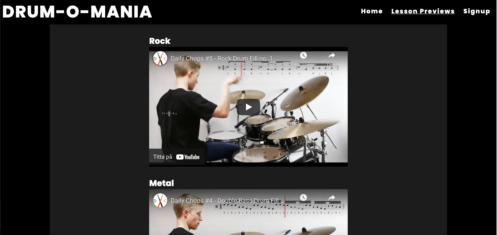
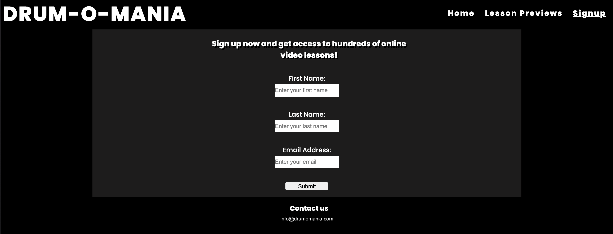

# DRUM-O-MANIA

DRUM-O-MANIA is a website with one specific goal - to help drummers perfect their craft and have fun while doing so, regardless of their age and experience. The online format is perfect for learning at your own pace, at your prefered location.

## **Features**

- **Navigation bar**
    - Featured at the top of all pages, the navigation bar displays the logo 'DRUM-O-MANIA' to the left, as well as links to the left to all three pages: Home, Lesson Previews and Signup.
    - This section lets the user easily switch between pages and also cleary indicates which page they are currently on.

- **Front page image**
    - The front page includes a photograph of a drummer. The idea is create an exciting vibe right from the start.

- **Front page overlay**
    - The front page has an overlay to the right explaining what the site is for. It also displays a list of what is included in the video lessons.
    - The overlay is positioned to the side and has a transparent background color to blend in better with the general look of the site.

- **Lesson Previews**
    - The lesson preview page displays a sample of the video lessons to let the user know what can be expected.
    - The videos are sorted according to genre.

- **Signup Form**
    - The signup page lets the user sign up to get access to the sites entire library of video lessons.
    - This section has a simple form to collect the users first name, last name and email adress. Everything is clearly labeled.

- **Footer**
    - The footer is located at the bottom of every page and works as a simple contact section. It has a small header with the text 'Contact Us' and an email address below it, centered to the page.

### Testing

- I have tested that this website is responsive, looks good and works as intended on the different standard screen sizes, using the devtools device toolbar in Google Chrome.

- I have tested that this website works in different browsers: Chrome, Safari, Firefox.

- I have confirmed that the audio/video controls are fully functional.

- I have confirmed that the navigation bar is fully functional. Hovering over the link changes the color, staying on a specific page activates an underline of that link, and the links direct you to the correct page. 

- I have confirmed that the form works, the email field will only accept text in email format and the submit button works.

### Validator Testing
- HTML
    - No errors were found when passing through the official [W3C Validator](https://validator.w3.org/nu/?doc=https%3A%2F%2Fjonathanrange.github.io%2FDrum-o-Mania%2F)

- CSS
    - No errors were found when passing through the official [(Jigsaw) Validator](https://jigsaw.w3.org/css-validator/validator?uri=https%3A%2F%2Fjonathanrange.github.io%2FDrum-o-Mania%2F&profile=css3svg&usermedium=all&warning=1&vextwarning=&lang=sv)

### Unfixed Bugs
No unfixed bugs

## Deployment

- The site was deployed to GitHub pages. The steps to deploy are as follows:
    - In the GitHub repository, navigate to the Settings tab
    - From the source section drop-down menu, select the Master Branch
    - Once the master branch has been selected, the page will be automatically refreshed with a detailed ribbon display to indicate the successful deployment.

The live link can be found here: [DRUM-O-MANIA](https://jonathanrange.github.io/Drum-o-Mania/)

## Credits

### Content
- The code to reverse the order of the navbar was modified from [Stackoverflow](https://stackoverflow.com/questions/35923720/reverse-ul-ordering-using-css-2-1)

- The code to make the videos responsive was taken from [Stackoverflow](https://stackoverflow.com/questions/17838607/making-an-iframe-responsive)

- The code for the front page overlay was taken from Code Institute's [Love Running Project](https://learn.codeinstitute.net/courses/course-v1:CodeInstitute+LR101+2021_T1/courseware/4a07c57382724cfda5834497317f24d5/6fd29d155c3b42248ff57bae32978a4b/?child=first)

### Media
- The front page image was taken from [Pixabay](https://pixabay.com/)
- The videos were taken from the Youtube channel [Daily Chops](https://www.youtube.com/c/DailyChops/videos)